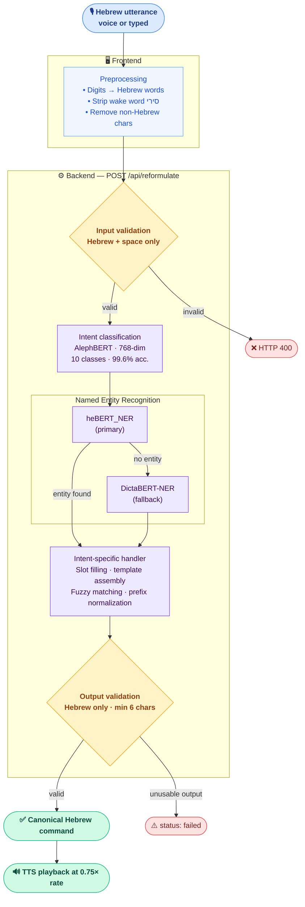

# Hebrew Voice Command Reformulator
### מנסח פקודות קוליות בעברית

> Converts natural spoken Hebrew utterances into canonical, Siri-ready commands — built for elderly Israeli smartphone users.
> Developed using Claude Code AI assistant


---

## Screenshots

<p align="center">
  
  <br/><em>Main interface — voice input and reformulated command card</em>
</p>
<!-- 📸 Replace docs/screenshots/main_interface.png with your screenshot -->

<p align="center">
  
  <br/><em>Result card — reformulated Siri command with text-to-speech playback button</em>
</p>
<!-- 📸 Replace docs/screenshots/result_card.png with your screenshot -->

<p align="center">
  
  <br/><em>Developer stats dashboard — per-intent feedback analytics at /stats</em>
</p>
<!-- 📸 Replace docs/screenshots/stats_dashboard.png with your screenshot -->

---

## Overview

Elderly Israeli smartphone users often struggle to phrase commands the way Siri expects. They speak naturally — colloquially, with filler words, unusual word order, or missing keywords — and Siri misunderstands them.

This system acts as a **bridge layer**: it accepts a freeform spoken Hebrew utterance, classifies its intent using a fine-tuned BERT model, extracts named entities (people, locations, dates/times) with a dual NER pipeline, and reconstructs a clean canonical command that Siri reliably understands. The reformulated command is read aloud to the user at a comfortable pace, ready to be spoken to Siri.


## Features

- **Voice input** — Browser-native speech recognition (Web Speech API, `he-IL`), 30-second auto-stop, live transcription in real time
- **Text-to-speech output** — Reformulated command read aloud at 0.75× speed, paced for comfortable listening by older adults
- **10-intent NLP pipeline** — Fine-tuned AlephBERT classifier (99.6% accuracy) covering calls, SMS, alarms, navigation, weather, calendar, search, camera, notes, and flashlight
- **Dual NER pipeline** — `heBERT_NER` as primary, `DictaBERT-NER` as fallback for robust Hebrew named-entity extraction
- **Fuzzy matching** — Levenshtein distance (<2–3 edits) strips filler words and tolerates speech recognition errors
- **Frontend preprocessing** — Digits converted to Hebrew words, wake word "סירי" stripped, non-Hebrew characters removed before the request reaches the backend
- **Two-stage validation** — Input validated before inference; output validated after reformulation; failures surface as user-friendly messages, never raw errors
- **Feedback collection** — After each reformulation users can report whether Siri understood; results stored in an append-only JSONL log
- **Developer stats dashboard** — Per-intent success rates, success percentage over time, full log viewer at `/stats`
- **Full RTL Hebrew UI** — Rubik and Heebo fonts, right-to-left layout throughout, Hebrew-idiomatic error messages
- **Large touch targets** — All interactive elements ≥ 54 px, designed for older adults with reduced dexterity

---

## Architecture



### Key Components

| Component | Description |
|-----------|-------------|
| `command_reformulatuin_script.py` | NLP core — 1,256 lines, 10 intent handlers, dual NER pipeline |
| `backend/main.py` | FastAPI app, routes, async startup/shutdown lifecycle |
| `backend/pipeline.py` | Three-stage orchestration (validate → classify → reformulate) |
| `backend/model_loader.py` | AlephBERT intent classifier — deferred load, eval mode |
| `backend/validators.py` | Input and output validation (Hebrew + space charset) |
| `backend/schemas.py` | Pydantic request/response models |
| `backend/feedback_logger.py` | Append-only JSONL feedback writer |
| `backend/stats_reader.py` | Feedback aggregation and per-intent statistics |
| `frontend/src/App.jsx` | Root component — state, API call, layout |
| `frontend/src/components/` | `CommandInput`, `ResultDisplay`, `FeedbackDialog` |
| `frontend/src/utils/useSpeechRecognition.js` | Voice input hook (he-IL, 30s auto-stop) |
| `frontend/src/utils/useTTS.js` | Text-to-speech hook (he-IL, 0.75× rate) |
| `frontend/src/utils/preprocessInput.js` | Pre-send cleaning and number normalization |
| `intent_model/` | Fine-tuned AlephBERT weights (`model.safetensors`) |

---

## Tech Stack

| Layer | Technology |
|-------|------------|
| Backend framework | Python 3.10+, FastAPI, Uvicorn |
| NLP runtime | Hugging Face Transformers 4.44.2, PyTorch 2.0+ |
| Intent classification | Fine-tuned AlephBERT — 768-dim, 10 classes, 99.6% acc. |
| NER (primary) | `avichr/heBERT_NER` |
| NER (fallback) | `dicta-il/dictabert-ner` |
| Fuzzy matching | `python-Levenshtein` |
| Frontend framework | React 18, Vite 4 |
| Styling | CSS Modules, Rubik + Heebo fonts |
| Voice I/O | Web Speech API (`SpeechRecognition` + `SpeechSynthesis`) |
| Routing | React Router v7 |
| Testing | Pytest 8, FastAPI TestClient (httpx) |

---

## Requirements

- **Python** 3.10 or later
- **Node.js** 18 or later
- **RAM** ~2 GB available (three transformer models load at startup)
- **Browser** Chrome (desktop / Android) or Safari (iOS) for voice input via Web Speech API; all other browsers support typed input only
- **OS** Windows, macOS, or Linux — see the Windows-specific note below before upgrading `transformers`

---

## Installation & Running

### 1. Backend

```bash
# Clone the repository and enter the project directory
git clone <repo-url>
cd reformulation_tool_app

# Create and activate a virtual environment (recommended)
python -m venv .venv
source .venv/bin/activate        # macOS / Linux
.venv\Scripts\activate           # Windows

# Install Python dependencies
pip install -r requirements.txt

# Start the API server
uvicorn backend.main:app --reload --host 0.0.0.0 --port 8000
```

Expected output on first start:

```
=== Startup: loading intent classifier from ./intent_model ===
=== All models ready. Server accepting requests. ===
INFO:     Uvicorn running on http://0.0.0.0:8000
```

> **Note:** The first startup loads three transformer models (~10–20 seconds). After that, every request is fast with no per-request cold starts.

### 2. Frontend

```bash
cd frontend
npm install        # first time only
npm run dev
```

Open **http://localhost:5173** in your browser. The Vite dev server proxies all `/api/*` requests to the backend at `http://127.0.0.1:8000`, so both servers must be running simultaneously.

Interactive API docs (auto-generated by FastAPI) are available at:
- `http://localhost:8000/docs` — Swagger UI
- `http://localhost:8000/redoc` — ReDoc

---

## How the App Works

1. The user types a Hebrew command or clicks the microphone icon to speak it.
2. The frontend preprocesses the input silently before sending:
   - Converts digits to Hebrew words (`7` → `שבע`, `514` → `חמש מאות וארבע עשרה`)
   - Removes the wake word `סירי` if present
   - Strips any characters outside the Hebrew alphabet and space
3. The cleaned text is sent to `POST /api/reformulate`.
4. The backend validates the input, classifies the intent, and dispatches to the appropriate handler.
5. The handler runs NER on the utterance, fills template slots, and returns a canonical command string.
6. The reformulated command is displayed on screen.
7. The user presses the speaker button to hear the command read aloud (at 0.75× speed) before speaking it to Siri.
8. After each reformulation, the user can report whether Siri understood — this feedback is stored for analysis.

---

## Running Tests

```bash
# Full test suite
pytest tests/ -v

# Validator unit tests only — fast, no models needed
pytest tests/test_validators.py -v

# API integration tests — loads all models (~30 s first run)
pytest tests/test_api.py -v
```

The test suite includes **48 validator unit tests** and **34 API integration tests**.

---

## API Reference

### `GET /health`

Liveness probe.

**Response — 200 OK**

```json
{ "status": "ok", "models_loaded": true }
```

---

### `POST /reformulate`

Accepts a preprocessed Hebrew utterance, classifies its intent, extracts named entities, and returns a canonical Siri command.

**Request body**

```json
{ "utterance": "תשלחי הודעה לישראל שאני מאחרת" }
```

**Response — 200 OK (success)**

```json
{
  "status": "success",
  "original": "תשלחי הודעה לישראל שאני מאחרת",
  "intent_id": 2,
  "intent_label": "sms",
  "reformulated": "שלח הודעה לישראל אני מאחרת"
}
```

**Response — 200 OK (pipeline produced no valid output)**

```json
{
  "status": "failed",
  "original": "תזמין שולחן לשניים",
  "intent_id": 5,
  "intent_label": "calendar",
  "reformulated": null
}
```

**Response — 400** — empty, whitespace-only, or invalid characters in input.

**Response — 422** — malformed request body or missing `utterance` field.

**Response — 500** — unexpected pipeline error (details logged server-side only).

---

### `POST /feedback`

Log whether Siri understood the reformulated command.

**Request body**

```json
{
  "original_input": "תשלחי הודעה לישראל",
  "intent_id": 2,
  "intent_label": "sms",
  "reformulated_command": "שלח הודעה לישראל",
  "backend_status": "success",
  "siri_understood": true,
  "notes": null
}
```

**Response — 200 OK**

```json
{ "ok": true }
```

---

### `GET /stats`

Aggregated feedback statistics for the developer dashboard.

**Response — 200 OK**

```json
{
  "total": 42,
  "siri_understood": {
    "yes": 35, "no": 5, "unanswered": 2,
    "yes_pct": 83.3, "no_pct": 11.9, "unanswered_pct": 4.8
  },
  "by_intent": {
    "sms":  { "total": 15, "yes": 13, "no": 2, "unanswered": 0 },
    "call": { "total": 12, "yes": 10, "no": 2, "unanswered": 0 }
  },
  "records": [ ... ]
}
```

---

## Input Validation

The backend accepts only Hebrew letters (U+05D0–U+05EA) and ASCII space. Validation runs in two stages:

1. **Input stage** — before the pipeline. Invalid input → HTTP 400.
2. **Output stage** — after reformulation. Unusable output → `status: "failed"`, HTTP 200.

The frontend preprocessing pipeline mirrors these rules and cleans the input silently at submit time so users never see a validation error for typical voice or typed input.

---

## Project Structure

```
reformulation_tool_app/
├── backend/
│   ├── main.py                     FastAPI app, routes, async startup/shutdown
│   ├── pipeline.py                 Three-stage pipeline orchestration
│   ├── model_loader.py             AlephBERT intent classifier wrapper
│   ├── validators.py               Input and output validation logic
│   ├── schemas.py                  Pydantic request/response models
│   ├── feedback_logger.py          Append-only JSONL feedback writer
│   └── stats_reader.py             Feedback aggregation for /stats
├── frontend/
│   ├── index.html                  Root HTML (RTL, Hebrew fonts)
│   ├── vite.config.js              Vite config + /api proxy to :8000
│   └── src/
│       ├── App.jsx                 Root component — state, API call, layout
│       ├── Router.jsx              Route definitions
│       ├── components/
│       │   ├── CommandInput.jsx    Text field + microphone button + submit
│       │   ├── ResultDisplay.jsx   Result / error card + TTS button
│       │   └── FeedbackDialog.jsx  Post-reformulation feedback form
│       └── utils/
│           ├── preprocessInput.js       Pre-send cleaning pipeline
│           ├── normalizeNumbers.js      Digit → Hebrew word conversion (0–999)
│           ├── useSpeechRecognition.js  Voice input hook (he-IL, 30s auto-stop)
│           └── useTTS.js               Text-to-speech hook (he-IL, 0.75× rate)
├── intent_model/                   Fine-tuned AlephBERT weights (local)
├── tests/
│   ├── conftest.py                 Session-scoped TestClient fixture
│   ├── test_validators.py          48 validator unit tests
│   └── test_api.py                 34 API integration tests
├── command_reformulatuin_script.py NLP pipeline core (1,256 lines)
├── requirements.txt                Python dependencies
├── pytest.ini                      Pytest configuration
└── logs/
    └── feedback.jsonl              Feedback records, append-only (auto-created)
```

---

## Notes & Known Limitations

- **`transformers==4.44.2` is pinned.** Versions 5.x introduce a new `modeling_layers.py` abstraction that deepens the call stack beyond Windows' 1 MB default thread stack limit, causing `STATUS_GUARD_PAGE_VIOLATION` crashes. Do not upgrade without testing on your target OS.
- **Voice input requires Chrome or iOS Safari.** Firefox and other browsers do not implement the Web Speech API. Typed input works in all browsers.
- **Number normalization is frontend-only.** Digits (e.g., `7`) are converted to Hebrew words (`שבע`) by the frontend before the request is sent. The backend validator rejects raw digits.
- **Models load at startup, not on first request.** Cold start is ~10–20 seconds; after that all requests are fast.
- **Feedback is fire-and-forget.** Logging failures are silently ignored and never surface to the user.
- **CORS is open (`*`) in development.** For production, restrict allowed origins in `backend/main.py` to your deployed frontend URL.
